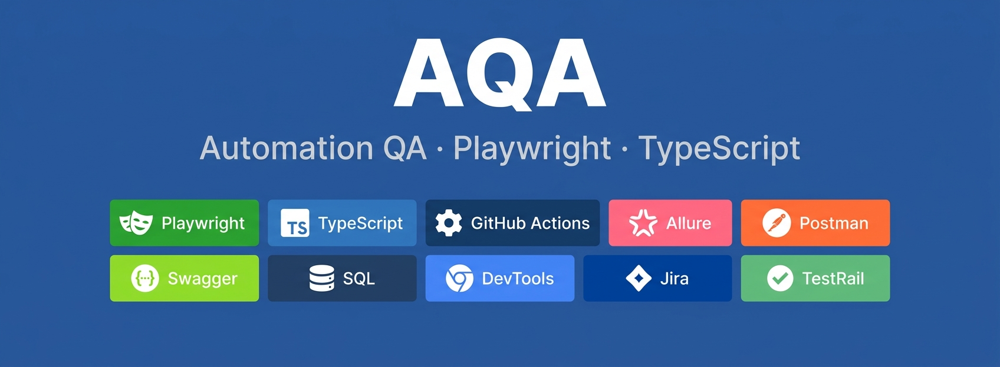

  

  
# Дарья Гембар

**QA Engineer · Manual + Automation**

[Portfolio](https://github.com/DaryaGembar) · [PomidorQA](https://github.com/DaryaGembar/PomidorQA-tests) · [Resume](https://spb.hh.ru/resume/08d4f43eff10e3565c0039ed1f697539696551) · [Telegram](https://t.me/DaryaGembar) · [Email](mailto:daragembar@gmail.com)

---

Тестирую **веб-приложения и REST API вручную и автоматизирую ключевые сценарии** так, чтобы результат
можно было **доказать, воспроизвести и быстро диагностировать**.

Основной стек: **Playwright + TypeScript**, REST API, Postman, Chrome DevTools, SQL, Git и GitHub Actions.

**Санкт-Петербург** · удалённый / гибридный / офисный формат

---

## Избранные QA-проекты

### [PomidorQA — Automation QA](https://github.com/DaryaGembar/PomidorQA-tests)

Основной automation-проект на **Playwright + TypeScript** с Unit, API и E2E-проверками,
cross-browser regression и traceability от требований до тестов.

- **50 / 50 требований** прошли аудит;
- **42 / 50 requirements automated = 84%** (4 partial, 1 known defect, 2 out of scope, 1 not covered);
- **80+ automated checks**: Unit + API + E2E на живом стенде;
- **E2E в Chromium**, реальные browser contexts для многосессионных сценариев;
- **Page Object Model**, семантические локаторы (`getByRole`, `getByLabel`, `getByTestId`);
- **API-based Arrange** и каскадный cleanup через `finally`;
- **CI: 5 параллельных кубов** (lint / unit / api / e2e / allure-report);
- **Allure-отчёт** на GitHub Pages с историей;
- **Telegram-уведомления** о статусе и артефактах падений;
- **AI-reviewer** для PR через Claude Opus 5 (Polza.ai) с защитой от prompt injection.

📊 [Allure-отчёт последнего прогона](https://daryagembar.github.io/PomidorQA-tests/)

---

## Что я делаю в QA

| Слой | Чем занимаюсь |
| --- | --- |
| **Test design** | Пишу планы проверок — что тестируем, в каком объёме, когда считаем готовым. Описываю сценарии в табличном виде: от простых проверок до граничных значений и негативных случаев |
| **Bug reports** | Severity/Priority, шаги воспроизведения, ожидаемое против фактического, доказательства, корневая причина, предложение по исправлению | 
| **Test automation** | POM, семантические локаторы, без `waitForTimeout`, auto-waiting через `expect().toPass()` и `expect.poll` |
| **Test pyramid** | E2E для сквозных сценариев, API для бизнес-правил, Unit для чистых функций |
| **CI / observability** | GitHub Actions с параллельными кубами, Allure с историей, артефакты падений |
| **Process** | Traceability требований, ревью PR, документирование known defects |
| **Manual** | Exploratory testing, чек-листы регресса, smoke после изменения стенда |

---

## Артефакты в репозитории PomidorQA

- 📋 [`docs/test-plan.md`](https://github.com/DaryaGembar/PomidorQA-tests/blob/main/docs/test-plan.md) — Test Plan с целями, стратегией, рисками, расписанием
- 📊 [`docs/coverage-matrix.md`](https://github.com/DaryaGembar/PomidorQA-tests/blob/main/docs/coverage-matrix.md) — трассировка 50 требований ↔ тесты
---

## Контакты

---

📍 Санкт-Петербург · GMT+3 · Этот README обновляется по мере роста портфолио.

---
